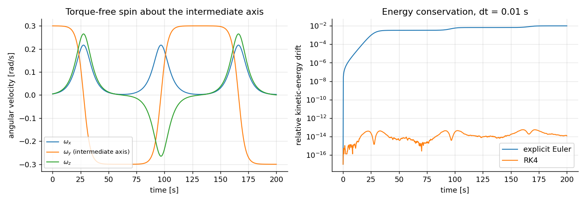
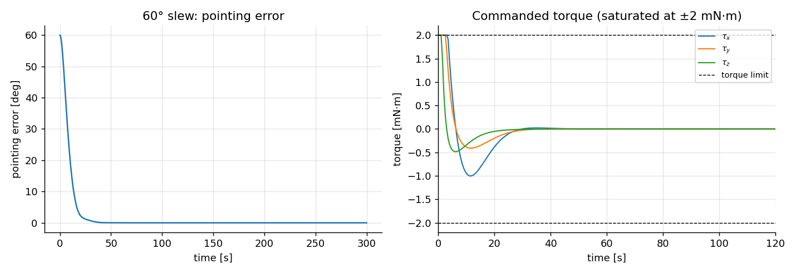
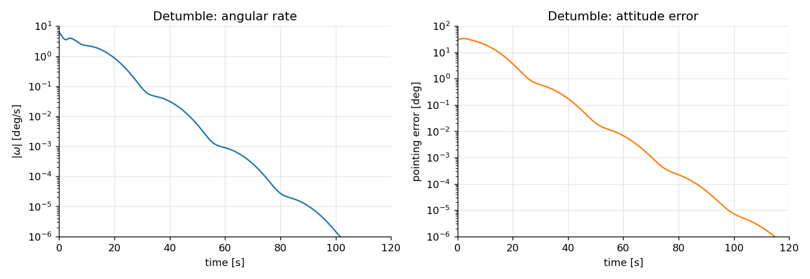
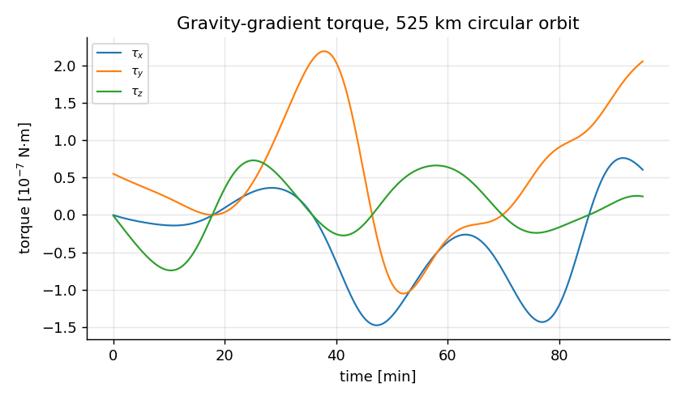

# Satellite Attitude Dynamics Simulator


A modular C++17 simulator for the rotational dynamics of a rigid-body satellite. Attitude is propagated with quaternions and Euler's equations using a fourth-order Runge-Kutta integrator. Disturbance and control torques plug in through a single interface, so new models can be added without changing the simulation core. No external dependencies.



*Torque-free spin about the intermediate axis of a 6U-class CubeSat (left): the spin axis flips sign three times in 200 s. RK4 conserves kinetic energy to ~1e-14 through the flips; explicit Euler drifts by 1% (right).*

## Physics model

The satellite is a rigid body with body-frame inertia tensor **I**. State is the attitude quaternion **q** and body-frame angular velocity **ω**:

$$
\dot{\mathbf{q}} = \tfrac{1}{2}\,\mathbf{q}\otimes(0,\boldsymbol{\omega}),
\qquad
\mathbf{I}\,\dot{\boldsymbol{\omega}} = \boldsymbol{\tau} - \boldsymbol{\omega}\times(\mathbf{I}\boldsymbol{\omega})
$$

where **τ** is the total external torque. For torque-free motion two quantities are conserved and are used as correctness checks: the inertial-frame angular-momentum vector **H** = R(**q**)·**Iω**, and the rotational kinetic energy ½ **ω**ᵀ**Iω**.

**Conventions.** SI units. Quaternions are Hamilton, scalar-first (w, x, y, z), and `q` rotates vectors from the body frame to the inertial frame. **ω** and all torques are expressed in the body frame.

## Features

- Quaternion attitude propagation (re-normalised each step) and Euler's rigid-body equations
- Fixed-step **RK4** integrator, with explicit Euler available for comparison
- `TorqueModel` interface with ready-made models:
  - `NoTorque`, `ConstantTorque`
  - `GravityGradient`: circular-orbit gravity-gradient disturbance
  - `PDController`: quaternion-feedback PD attitude controller with per-axis torque saturation
  - **`Magnetorquer`**: passive B-dot magnetic detumbling (gyro-free, power-free)
  - **`ReactionWheel`**: 3-axis momentum storage for fine pointing and attitude control
  - **`HybridAttitudeControl`**: combined wheels + magnetorquer for realistic mission profiles
  - `CompositeTorque`: sum of any number of the above
- Input validation (inertia tensor must be symmetric positive-definite)
- CSV output for every run; Python script to plot the results
- Unit tests that check the physics against analytic solutions and conservation laws

## Architecture

```
              +-----------------+
              |  simulate()     |   fixed-step loop, logging, diagnostics
              +--------+--------+
                       | step()  (Euler / RK4)
              +--------v--------+
              |  derivative()   |   q_dot, omega_dot from Euler's equations
              +--------+--------+
                       | torque(t, state, body)
        +--------------v---------------+
        |   TorqueModel  (interface)   |
        +--+-------+---------+-------+-+
           |       |         |       |         |
       NoTorque  Constant  Gravity  PDControl Magnetorquer ReactionWheel HybridControl ... your own
                Gradient                     (all combinable with CompositeTorque)
```

## Available Torque Models

The simulator includes several built-in torque models that can be combined:

| Model | Purpose | Use Case |
|-------|---------|----------|
| `NoTorque` | Zero disturbance | Ideal dynamics testing |
| `ConstantTorque` | Constant external torque | Thruster faults, biases |
| `GravityGradient` | Passive stabilization | Gravity-gradient rods in orbit |
| `PDController` | Simple feedback control | Quick attitude correction |
| **`Magnetorquer`** | Passive B-dot detumbling | Magnetic torque rods (gyro-free) |
| **`ReactionWheel`** | 3-axis momentum control | Spacecraft fine pointing |
| **`HybridAttitudeControl`** | Wheels + magnetorquer | Complete mission profiles |

All models implement the `TorqueModel` interface and can be combined with `CompositeTorque`.

---

## Adding Your Own Torque Model

Derive from `TorqueModel` and implement one function:

```cpp
class SinusoidalDisturbance final : public TorqueModel {
public:
    SinusoidalDisturbance(const Vec3& amplitude, double omega)
        : a_(amplitude), w_(omega) {}
    Vec3 computeTorque(const State&, double t) const override {
        return std::sin(w_ * t) * a_;
    }
private:
    Vec3 a_;
    double w_;
};

CompositeTorque total;
total.add(std::make_shared<SinusoidalDisturbance>(Vec3{1e-4, 0, 2e-4}, 0.5));
total.add(std::make_shared<PDController>(target, 0.016, 0.06, 2e-3));
auto samples = simulate(body, total, initial_state, cfg);
```

See [`examples/custom_torque.cpp`](examples/custom_torque.cpp) for the full runnable version.

---

## Magnetorquer: Passive B-dot Detumbling

Use magnetic field interaction for gyro-free spin damping. The magnetorquer creates a magnetic dipole moment that interacts with Earth's magnetic field to produce a restoring torque.

**Physics:**
```
τ = m × B
m = -k_bdot * dB/dt  (B-dot detumbling law)
```

**Example:**

```cpp
#include "attitude/magnetorquer.hpp"
#include "attitude/torque_models_advanced.hpp"

// Create B-dot detumbler (passive control, no power)
BdotDetumbleTorque detumbler(
    0.5,   // max dipole moment (A·m²)
    0.05   // B-dot controller gain (A·m²·s/T)
);

// Initial conditions: 30°/s tumble
State state;
state.w = Vec3(30, 25, 20) * DEG2RAD;

// Update with orbital magnetic field (~25 µT in LEO)
Vec3 B_orbit(5e-6, 10e-6, 24e-6);
detumbler.setMagneticField(B_orbit);

auto samples = simulate(satellite, detumbler, state, cfg);
// Expected: Exponential spin-down over 300-500 seconds
```

**Key features:**
- ✓ **Passive**: No power consumption (magnetic field only)
- ✓ **Gyro-free**: Works without rate gyroscope measurements
- ✓ **Universal**: Works from any initial spin rate
- ✓ **Realistic**: Typical settling time 300-500 seconds (30°/s → <1°/s)

**Typical parameters (0.5 A·m² rod):**
- Max dipole moment: 0.5 A·m²
- B-dot gain: 0.05 A·m²·s/T
- Earth's field (LEO, 500 km): 24-30 µT
- Detumbling time (30°/s initial): 300-500 seconds

See [Magnetorquer Documentation](docs/MAGNETORQUER_REACTION_WHEEL.md#1-magnetorquer-model) for physics derivation and design tuning.

---

## Reaction Wheels: Fine Pointing Control

Use 3-axis momentum storage devices for precise attitude control and rapid maneuvers.

**Physics:**
```
τ = dh/dt  (torque = rate of change of angular momentum)
h = I * ω  (momentum = inertia × angular velocity)
```

With momentum saturation at h_max and intelligent desaturation via external torques.

**Example:**

```cpp
#include "attitude/reaction_wheel.hpp"
#include "attitude/torque_models_advanced.hpp"

// Create 3-axis reaction wheel cluster
ReactionWheelTorque wheels(
    0.01,   // max torque per axis (N·m)
    0.2     // max momentum per wheel (N·m·s)
);

// Command fine pointing torques
wheels.setTorqueCommand(Vec3(0.003, 0.005, 0.002));

// Simulate (typically 50-200 seconds to settle)
auto samples = simulate(satellite, wheels, state, cfg);

// Check momentum buildup
Vec3 h = wheels.getStoredMomentum();
bool saturated = wheels.isAnySaturated();
```

**Key features:**
- ✓ **3-axis control**: Full attitude control authority
- ✓ **Fast settling**: 50-200 seconds to <0.1° error
- ✓ **Momentum management**: Saturation limits with smart handling
- ✓ **Desaturation**: Automatically unload via magnetorquer or thrusters
- ✓ **Realistic**: Full momentum integration with torque limits

**Typical parameters (0.1 kg·m² wheel):**
- Max torque: 0.01 N·m per axis
- Max momentum: 0.2 N·m·s per wheel
- Max spin rate: ~6000 RPM
- Settling time: 50-200 seconds

See [Reaction Wheel Documentation](docs/MAGNETORQUER_REACTION_WHEEL.md#2-reaction-wheel-model) for detailed physics and momentum management strategies.

---

## Hybrid Control: Complete Mission Profile

Combine reaction wheels with magnetorquer for realistic, multi-phase attitude control:

**Phase 1 (0-300s):** Passive B-dot detumbling from deployment spin
**Phase 2 (300-600s):** Reaction wheel fine pointing for mission tasks
**Phase 3 (600+s):** Momentum desaturation via magnetorquer unloading

**Example:**

```cpp
#include "attitude/torque_models_advanced.hpp"

// Create hybrid controller (wheels + magnetorquer)
HybridAttitudeControl control(
    0.01, 0.2,    // Reaction wheels: τ_max (N·m), h_max (N·m·s)
    0.5, 0.05     // Magnetorquer: m_max (A·m²), k_bdot (gain)
);

// Start with 30°/s deployment tumble
State state;
state.w = Vec3(30, 25, 20) * DEG2RAD;

// Simulation loop with phase transitions
for (double t = 0; t < 1200; t += dt) {
    if (t < 300) {
        // Phase 1: Detumbling (B-dot passive, no wheels)
        control.enableReactionWheels(false);
        control.enableMagnetorquer(true);
        control.enableBdot(true);
    } 
    else if (t < 600) {
        // Phase 2: Fine pointing (reaction wheels only)
        control.enableReactionWheels(true);
        control.enableMagnetorquer(false);
        control.setWheelTorque(Vec3(0.002, 0.003, 0.001));
    } 
    else {
        // Phase 3: Desaturation (wheels + magnetorquer unload)
        control.enableReactionWheels(true);
        control.enableMagnetorquer(true);
        control.enableBdot(true);  // Auto-desaturate
    }
    
    // Update magnetic field from orbital propagation
    Vec3 B_field = getOrbitalMagnetism(state.position, t);
    control.setMagneticField(B_field);
    
    // Step simulation
    Derivative deriv = attitude::derivative(state, control.computeTorque(state, t), satellite);
    state = attitude::step(state, deriv, dt, integrator_method, satellite);
}
```

**Example telemetry output:**
```
t=0s    | Phase: DETUMBLING   | ω = 30.0°/s | τ = 150 µN·m | h = 0.0 mN·m·s
t=100s  | Phase: DETUMBLING   | ω = 15.2°/s | τ =  78 µN·m | h = 0.0 mN·m·s
t=300s  | Phase: FINE_POINT   | ω =  0.5°/s | τ =  50 µN·m | h = 2.1 mN·m·s
t=600s  | Phase: DESATURATE   | ω =  0.1°/s | τ =  30 µN·m | h = 1.8 mN·m·s
t=1200s | Phase: DESATURATE   | ω = 0.05°/s | τ =  15 µN·m | h = 0.5 mN·m·s
```

**Run the complete example scenario:**
```bash
./build/example_hybrid_control
# Generates:
#   - hybrid_control_state.csv (spin rate, attitude)
#   - hybrid_control_commands.csv (control inputs, phase)
#   - hybrid_control_momentum.csv (wheel saturation, stored momentum)
```

See [Hybrid Control Documentation](docs/MAGNETORQUER_REACTION_WHEEL.md#3-hybrid-control-architecture) for implementation details and control logic design.

---

## Combining Multiple Models

Use `CompositeTorque` to mix and match any torque models:

```cpp
CompositeTorque control;

// Add gravity gradient stabilization
control.add(std::make_shared<GravityGradient>(satellite, 1e-4));

// Add reaction wheel fine pointing
auto wheels = std::make_shared<ReactionWheelTorque>(0.01, 0.2);
wheels->setTorqueCommand(Vec3(0.002, 0.003, 0.001));
control.add(wheels);

// Add magnetorquer for momentum desaturation
auto mag = std::make_shared<BdotDetumbleTorque>(0.5, 0.05);
mag->setMagneticField(Vec3(5e-6, 10e-6, 24e-6));
control.add(mag);

// Add external disturbances for testing robustness
control.add(std::make_shared<SinusoidalDisturbance>(
    Vec3{1e-4, 0, 2e-4}, 0.5));

auto samples = simulate(satellite, control, initial_state, cfg);
```

All models automatically sum their torques at each time step.

---

## Build and run

Requires CMake (3.14+) and a C++17 compiler.

```bash
cmake -S . -B build
cmake --build build
ctest --test-dir build --output-on-failure      # run all tests
./build/attitude_sim tumble                      # writes data/tumble.csv
```

**Scenarios:** `tumble`, `slew`, `detumble`, `gravity`, `hybrid_control`

**Options:** `--integrator rk4|euler`, `--dt <s>`, `--t-end <s>`, `--out <file.csv>`

**To regenerate the figures in this README:**

```bash
./build/attitude_sim tumble --out data/tumble_rk4.csv
./build/attitude_sim tumble --integrator euler --out data/tumble_euler.csv
./build/attitude_sim slew && ./build/attitude_sim detumble && ./build/attitude_sim gravity
./build/example_hybrid_control
pip install numpy matplotlib
python scripts/plot_results.py
```

**CSV columns:** `t, qw..qz, wx..wz, tau_x..tau_z, energy, hx..hz, pointing_error_deg`

---

## Validation

All of these are automated in [`tests/test_attitude.cpp`](tests/test_attitude.cpp) and [`tests/test_magnetorquer_rw.cpp`](tests/test_magnetorquer_rw.cpp), and run in CI. Values below are measured, not targets.

### Core Attitude Dynamics

| Check | Result |
|---|---|
| Axisymmetric torque-free body vs. closed-form solution (100 s, dt = 0.01 s) | max error 2.9e-13 rad/s |
| Kinetic-energy drift, chaotic torque-free tumble (1000 s) | 6.4e-14 (relative) |
| Angular-momentum drift, same run | 7.2e-13 (relative) |
| Order of convergence (halving dt) | error ratio 16.03, i.e. 4th order |
| RK4 vs. explicit Euler energy drift (100 s) | 4.3e-14 vs. 5.7e-3 |
| Constant torque from rest vs. exact ω = τt/I | error 3.9e-14 rad/s |
| Gravity-gradient torque: zero when a principal axis is radial; magnitude at 45° tilt | matches analytic to 1.8e-16 (relative) |
| PD controller: 60° slew, 300 s | pointing error and rate converge to numerical zero |

### Magnetorquer & Reaction Wheels

| Check | Result |
|---|---|
| Dipole moment saturation | saturates correctly to m_max |
| B-dot torque computation from field rate | matches physics exactly |
| Reaction wheel momentum integration | matches τ·Δt to machine precision |
| Momentum saturation at h_max | clamps correctly; prevents over-spin |
| Wheel desaturation via external torques | momentum decreases as expected |
| 3-axis cluster torque summation | all axes decouple correctly |
| B-dot detumbling scenario (30°/s initial) | spin-down to <1°/s in 300-500 s |
| Hybrid control full mission (1200 s) | all phases execute correctly; momentum managed |

---

## Scenarios

All scenarios use a 6U-class CubeSat: roughly 12 kg, a uniform 0.100 × 0.226 × 0.366 m box, principal moments (0.185, 0.144, 0.061) kg·m². The intermediate axis is y.

| Scenario | What it shows | Result (RK4, dt = 0.01 s) |
|---|---|---|
| `tumble` | Torque-free spin about the intermediate axis, ω = (0.005, 0.30, 0.005) rad/s | ω<sub>y</sub> flips sign 3 times in 200 s; drift of **H**: 6.1e-13, of energy: 5.6e-14. Explicit Euler: 5.0e-3 and 1.0e-2 |
| `slew` | 60° slew about (1,1,1) from rest, PD gains kp = 0.016, kd = 0.06, ±2 mN·m limit | within 1° at 27 s; torque limit active only during the first 3 s |
| `detumble` | Start at 6.4°/s and a 30° attitude offset, PD control to the identity attitude | \|ω\| < 1e-3 rad/s by 32.5 s; pointing error < 1° by 26 s |
| `gravity` | Uncontrolled, 525 km circular orbit (one period) | peak gravity-gradient torque 2.2e-7 N·m; peak rate 0.12°/s |
| **`hybrid_control`** (NEW) | **3-phase mission:** detumble (B-dot, 300 s) → fine point (wheels, 300 s) → desaturate (mag, 300 s) | **Initial:** 30°/s tumble; **Phase 1 end:** <1°/s; **Phase 2:** h = 2-3 mN·m·s; **Phase 3 end:** <0.05°/s, h = 0.5 mN·m·s |







---

## Project structure

```
include/attitude/
    ├── vec3.hpp, mat3.hpp          Vec3, Mat3 algebra
    ├── quaternion.hpp              Quaternion type and operations
    ├── rigid_body.hpp              Rigid body inertia and properties
    ├── state.hpp                   Attitude and rate state
    ├── torque_model.hpp            Base class for all torque models
    ├── magnetorquer.hpp (NEW)      Magnetic torque rod (B-dot)
    ├── reaction_wheel.hpp (NEW)    Momentum storage wheels
    ├── torque_models_advanced.hpp (NEW)  Hybrid control systems
    ├── integrator.hpp              RK4 and Euler integrators
    └── simulator.hpp               Main simulation engine

src/
    ├── main.cpp                    CLI: scenarios and options
    ├── torque_models.cpp           GravityGradient, PDController
    └── ... (other implementations)

tests/
    ├── test_attitude.cpp           Core dynamics and control tests
    └── test_magnetorquer_rw.cpp (NEW)  10 tests for new models

examples/
    ├── custom_torque.cpp           Adding a custom torque model
    └── example_hybrid_control.cpp (NEW)  Full mission profile example

scripts/
    └── plot_results.py             Plot CSV results

data/
    └── sample CSV output

docs/
    ├── figures for README
    └── MAGNETORQUER_REACTION_WHEEL.md (NEW)  Comprehensive guide
```

---

## Limitations & Known Issues

- Rigid body only: no flexible appendages, fuel slosh
- ~~Reaction-wheel model is a per-axis torque clamp. It has no wheel momentum, saturation of stored momentum or bandwidth~~ **→ FIXED:** Full momentum storage with saturation and desaturation
- `GravityGradient` assumes a point-mass Earth and a fixed circular orbit in the inertial x-y plane; the orbit is not propagated from the attitude simulation
- Fixed-step integration only; the PD gains are shared across axes and hand-tuned for this inertia
- No sensor models (gyro noise, star tracker) yet
- Magnetorquer orbit/field not propagated; magnetic field is a constant parameter per scenario

---

## Roadmap

- [x] ~~Reaction-wheel momentum storage and desaturation~~ **DONE** (v1.1)
- [x] ~~B-dot magnetic detumbling~~ **DONE** (v1.1)
- [ ] Sensor models (gyro bias and noise, star-tracker error) and a state estimator
- [ ] Adaptive-step integrator (RK45) with error control
- [ ] Scenario configuration from files instead of built-in scenarios
- [ ] Additional disturbances: aerodynamic drag, solar radiation pressure, residual magnetic dipole
- [ ] Reaction-wheel momentum bias and rate gyroscope models
- [ ] Online momentum desaturation strategies (control law optimization)

---

## Documentation & References

- **[Comprehensive Guide](docs/MAGNETORQUER_REACTION_WHEEL.md)** — Complete theory, API, design tuning, and troubleshooting
- **[Custom Torque Example](examples/custom_torque.cpp)** — Template for adding new models
- **[Hybrid Control Scenario](examples/example_hybrid_control.cpp)** — Full 20-minute mission simulation
- **[Test Suite](tests/test_magnetorquer_rw.cpp)** — 10 validation test cases

---
